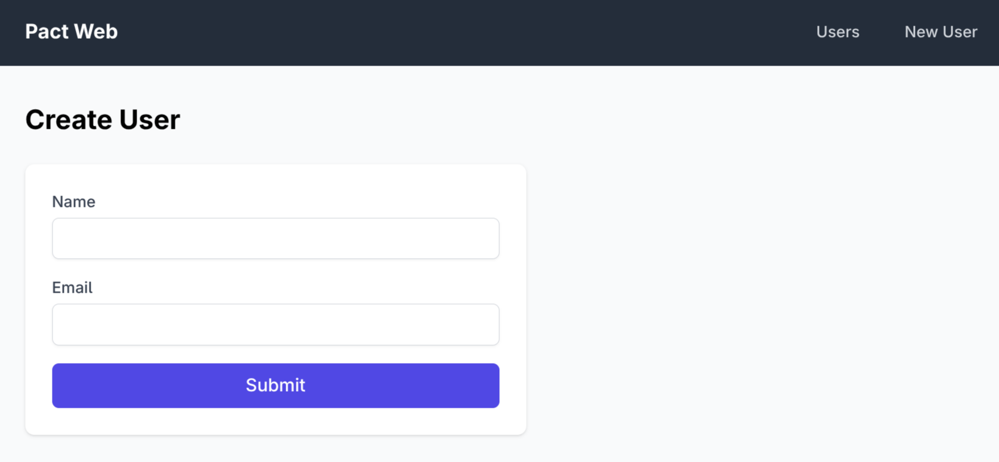

# pact-web

A **hand-written** [Axum](https://github.com/tokio-rs/axum) web application that demonstrates how to use code generated by [pact-lang](https://github.com/akitaonrails/pact-lang). Provides both server-rendered HTML pages (styled with Tailwind CSS) and a JSON API.



## How This Works

The pact-lang compiler generates a **single Rust source file** containing domain types, enums, and pure functions — but not a web app. This crate is the hand-written HTTP layer that wraps the generated code:

```
user-service.pct                ← Pact source (in pact-lang repo)
       │
       ▼  pact compile --runtime
user_service.rs                 ← Generated: structs, enums, functions (pure domain logic)
       │
       ▼  copied into src/generated/
pact-web                        ← Hand-written: routes, handlers, HTML rendering, server setup
       │
       ▼  cargo run
http://localhost:3000
```

The generated `user_service.rs` provides `User`, `CreateUserInput`, `GetUserByIdResult`, `CreateUserResult`, `get_user_by_id()`, and `create_user()`. This crate adds the HTTP glue: parsing requests, calling those functions, and rendering HTML/JSON responses.

The Pact source that drives this app is [`user-service.pct`](https://github.com/akitaonrails/pact-lang/blob/master/examples/user-service.pct) in the pact-lang repo.

**Note:** pact-web is not generated by the compiler. If you compiled a different `.pct` file (say an inventory service), you would need to write new handlers for it.

## Quick Start

```bash
# 1. Compile the Pact source to Rust (targeting pact-runtime)
cd ../pact-lang
cargo run -- compile --runtime examples/user-service.pct -o ../pact-web/src/generated/

# 2. Run the web server
cd ../pact-web
cargo run
```

Open [http://localhost:3000](http://localhost:3000) in your browser.

## Routes

### HTML Pages

| Method | Path | Description |
|--------|------|-------------|
| GET | `/` | List all users (table view) |
| GET | `/users/new` | Create user form |
| POST | `/users` | Handle form submission |
| GET | `/users/:id` | User detail page |
| POST | `/users/:id/delete` | Delete user and redirect |

### JSON API

| Method | Path | Status Codes | Description |
|--------|------|-------------|-------------|
| GET | `/api/users` | 200 | List all users |
| POST | `/api/users` | 201, 409, 422 | Create a user |
| GET | `/api/users/:id` | 200, 400, 404 | Get user by ID |

#### API Examples

```bash
# List users
curl http://localhost:3000/api/users

# Create a user
curl -X POST http://localhost:3000/api/users \
  -H "Content-Type: application/json" \
  -d '{"name": "Alice", "email": "alice@example.com"}'

# Get a user
curl http://localhost:3000/api/users/<uuid>

# Error responses
# 400 — invalid UUID format
# 404 — user not found
# 409 — duplicate email
# 422 — validation failed (e.g., empty name)
```

## Architecture

```
pact-web/
├── src/
│   ├── main.rs              # Axum server setup, routes, AppState
│   ├── handlers.rs          # HTML + JSON request handlers
│   ├── html.rs              # Tailwind-styled HTML helper functions
│   └── generated/
│       ├── mod.rs            # Module exports
│       └── user_service.rs   # Generated by pact compile --runtime
```

### App State

```rust
struct AppState {
    store: Arc<Mutex<InMemoryStore<User>>>,
}
```

The server uses `pact-runtime`'s `InMemoryStore<User>` wrapped in `Arc<Mutex<_>>` for thread-safe shared state. Data lives in memory and resets on restart.

### HTML Rendering

Server-side rendered HTML using helper functions in `html.rs`:

- `html_page(title, body)` — full HTML document with Tailwind CDN
- `html_nav(title, links)` — top navigation bar
- `html_table(headers, rows)` — styled data table
- `html_form(action, fields)` — input form with labels
- `html_alert(kind, message)` — success/error/warning alerts

No JavaScript frameworks, no build step. Just server-rendered HTML with Tailwind via CDN.

## End-to-End Pipeline

The full pipeline from YAML spec to running web app:

```
YAML spec → pact generate → .pct file → pact compile --runtime → Rust source → pact-web → browser
```

```bash
# Step 1: Generate .pct from YAML spec
cd ../pact-lang
cargo run -- generate examples/user-service.spec.yaml -o /tmp/user-service.pct

# Step 2: Compile to Rust targeting pact-runtime
cargo run -- compile --runtime /tmp/user-service.pct -o ../pact-web/src/generated/

# Step 3: Run the web server
cd ../pact-web
cargo run
# → http://localhost:3000
```

## Dependencies

| Crate | Purpose |
|-------|---------|
| `pact-runtime` | Runtime types, `Store<T>` trait, builtins |
| `axum` | HTTP framework |
| `tokio` | Async runtime |
| `serde` / `serde_json` | JSON serialization |
| `uuid` | UUID type |

## Related Crates

- **[pact-lang](https://github.com/akitaonrails/pact-lang)** — The compiler that produces the generated Rust code
- **[pact-runtime](https://github.com/akitaonrails/pact-runtime)** — Runtime types and traits the generated code depends on
